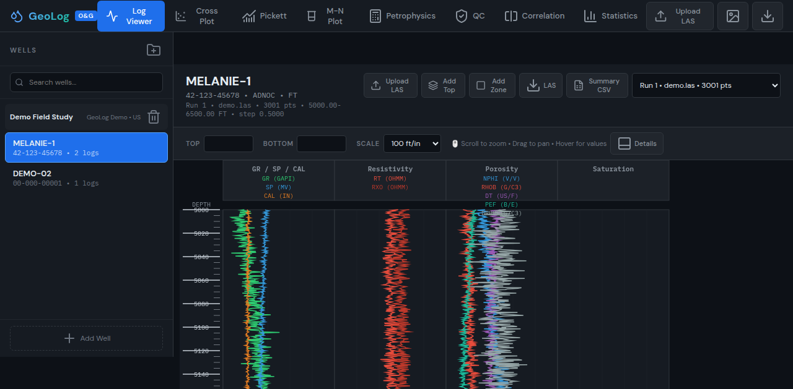

# GeoLog — Advanced Well Log Interpretation Platform

Comprehensive, production-style subsurface interpretation platform for oil & gas workflows. GeoLog combines high-performance log visualization, petrophysical computation, correlation, zonation, quality control, and export/reporting in a FastAPI + SQLite + Canvas-based stack.




---

## Features

GeoLog currently includes **35+ analysis views/panels** and **100+ API capabilities** spanning ingestion, interpretation, QC, analytics, collaboration, and export.

### 1) Data Ingest
- LAS **2.0/3.0** parser with robust field-file handling
- Supports whitespace and **comma-delimited** LAS variants
- Vendor mnemonic normalization/fallback (e.g., DEPTH/DEPT/MD, ILD/RESD/RT families)
- Multi-run per well upload and management
- **Bulk import wizard** for multi-file ingestion with progress feedback
- CSV upload utilities for selected workflows (e.g., tops/RFT)

### 2) Multi-Track Log Viewer
- High-performance **Canvas-rendered** viewer
- Standard **4-track layout** (GR/SP/CAL, resistivity, porosity, saturation)
- Adaptive depth ruler and synchronized hover readout
- Overlay support: formation tops, zones, DST intervals, RFT points, annotations
- Interactive navigation: **scroll zoom**, **drag pan**, jump-to-top/bottom
- Optional details/advanced controls and fullscreen workflow mode

### 3) Petrophysics
- Archie-based quicklook petrophysics
- **Dual-Water** saturation model endpoint/workflow
- VCL models:
  - **Larionov**
  - **Clavier**
  - **Steiber**
- Cutoff-based net pay evaluation and zone summaries
- Batch petrophysics workflows (sync + async)
- **Multi-mineral solver workflows** via calculator/derived-curve tooling

### 4) Well Correlation
- Interactive **2-well correlation panel**
- Manual marker tie picking with marker table/summary
- **AutoTie** (cross-correlation based shift recommendation)
- Shift/stretch controls with profile persistence
- Top-snap assistance and overlayed top matching cues

### 5) Cross-Section
- Project-level **well-to-well structural cross-section**
- Curve rendering/fill between wells
- Formation-top correlation lines across wells
- Stratigraphic normalization to reference formations
- Cross-section interaction helpers and export helpers

### 6) Formation Tops
- Full CRUD for formation tops
- Project/well-level import-export support
- **Petrel-compatible tops export**
- Auto-pick tops workflow with review and save
- Top overlays available in viewer and correlation/cross-section contexts

### 7) Zonation
- Manual zone editing + persistence
- **Auto-zone from tops**
- Zone statistics endpoints and panels
- Zonation report export (zone gross/net and averaged properties)
- Zone editing operations (split/merge/reorder) with undo/redo-aware workflow

### 8) QC & Data Quality
- Per-curve QC metrics (missing %, outlier %, mean/std)
- Reliability tagging (HIGH / MEDIUM / LOW)
- QC recommendations and anomaly notes
- **QC Auto-fix** API to patch common quality issues
- Small-sample confidence handling and warnings

### 9) Crossplots & Interpretation Plots
- **RHOB–NPHI crossplot**
- **Pickett plot**
- **M–N plot**
- **Hingle plot**
- **Buckles plot**
- **Probability plot**
- Crossplot matrix at project level

### 10) Sensitivity & Uncertainty
- Parameter sweep workflows for petrophysical uncertainty
- Scenario comparison summaries
- **Tornado chart** output for spread/impact visualization

### 11) Electrofacies
- Electrofacies clustering and facies assignment
- Supports **k-means / GMM-style** clustering workflows
- Facies distribution summaries and visualization
- Async electrofacies job execution with job monitor

### 12) DST / RFT
- DST interval entry/listing and viewer overlay
- RFT point entry/listing + CSV upload
- Pressure-depth crossplot canvas
- Pressure gradient computation endpoint

### 13) Curve Editing
- Interactive click-based curve editing workflows
- Curve overrides and filtering endpoints
- Edit persistence with history-aware interactions
- **Undo/redo** support for interactive interpretation actions

### 14) Core Calibration
- Core-log calibration workflows
- Depth matching utilities
- Porosity/permeability transform endpoints and derived properties

### 15) Export & Reporting
- Export **LAS** from selected/active data context
- Export **CSV** (summary tables, zonation, tops, data table)
- Export **PDF** report endpoint
- Export viewer **PNG**
- Export bulk JSON package for project handoff
- **Petrel-compatible tops** export

### 16) User Management & Governance
- Role-based access control (**viewer / interpreter / admin**)
- Header-driven role enforcement on API operations
- Built-in **audit trail** endpoint and UI panel
- User CRUD endpoints

### 17) Performance & Scalability
- LTTB-based data **decimation** endpoint
- Viewport-based loading for large logs
- Debounced curve fetch and selective rendering
- FastAPI **GZip compression** middleware
- Async job queue pattern for heavy workflows

---

## Quick Start

### Method 1 — One-command local run (`run.sh`)
```bash
cd /home/patrick/geolog-app
chmod +x run.sh
./run.sh
```
- Starts GeoLog at: `http://localhost:8000`
- Swagger: `http://localhost:8000/docs`

### Method 2 — Docker
```bash
cd /home/patrick/geolog-app
docker compose up --build
```
Then open `http://localhost:8000`.

### Method 3 — Manual (Python)
```bash
cd /home/patrick/geolog-app
python3 -m pip install -r requirements.txt
python3 -m uvicorn backend.main:app --host 0.0.0.0 --port 8000 --reload
```

---

## API Documentation

Interactive OpenAPI docs are available when server is running:
- Swagger UI: `http://localhost:8000/docs`
- ReDoc: `http://localhost:8000/redoc`

### Audit Signature Verification Contract (Compliance)

Export endpoint:
- `GET /api/audit-log/verify/export?sign=true&kid=<optional>`
- returns: `payload`, `signature`, `signature_alg`, `signature_kid`

Verify endpoints:
- `GET /api/audit-log/verify/signature` (query params: `payload`, `signature`, `kid`)
- `POST /api/audit-log/verify/signature` (JSON body: `payload`, `signature`, `kid`) — requires `interpreter` role

Verifier response fields:
- `ok`: boolean
- `reason`: human-readable detail
- `reason_code`: stable enum for machine integration
- `signature_alg`: currently `hmac-sha256`
- `signature_kid`: key-id used during verification

`reason_code` values:
- `SIGNATURE_VALID`
- `SIGNATURE_MISMATCH`
- `UNKNOWN_KID`
- `INVALID_KEYRING_JSON`
- `ACTIVE_KID_MISSING`
- `KEY_NOT_CONFIGURED`
- `KEY_RESOLUTION_ERROR` (fallback)

Signing key env config:
- `AUDIT_EXPORT_HMAC_KEYS_JSON='{"k1":"secret1","k2":"secret2"}'`
- `AUDIT_EXPORT_HMAC_ACTIVE_KID='k2'`
- legacy fallback: `AUDIT_EXPORT_HMAC_KEY`

End-to-end `curl` examples:

1) Export signed payload
```bash
curl -s "http://localhost:8000/api/audit-log/verify/export?sign=true&kid=k1" \
  -H "X-User-Role: viewer" > /tmp/audit_export.json
```

2) Verify via GET endpoint
```bash
PAYLOAD=$(jq -c '.payload' /tmp/audit_export.json)
SIGNATURE=$(jq -r '.signature' /tmp/audit_export.json)
KID=$(jq -r '.signature_kid' /tmp/audit_export.json)

curl -G -s "http://localhost:8000/api/audit-log/verify/signature" \
  -H "X-User-Role: viewer" \
  --data-urlencode "payload=${PAYLOAD}" \
  --data-urlencode "signature=${SIGNATURE}" \
  --data-urlencode "kid=${KID}" | jq .
```

3) Verify via POST endpoint (M2M, interpreter role)
```bash
jq '{payload: .payload, signature: .signature, kid: .signature_kid}' /tmp/audit_export.json > /tmp/audit_verify_req.json

curl -s -X POST "http://localhost:8000/api/audit-log/verify/signature" \
  -H "Content-Type: application/json" \
  -H "X-User-Role: interpreter" \
  --data-binary @/tmp/audit_verify_req.json | jq .
```

---

## Keyboard Shortcuts

| Shortcut | Action |
|---|---|
| `1` | Switch to Log Viewer |
| `2` | Switch to Cross Plot |
| `3` | Switch to Pickett Plot |
| `4` | Switch to Petrophysics |
| `5` | Switch to QC |
| `6` | Switch to Statistics |
| `7` | Switch to Correlation |
| `8` | Switch to Sensitivity |
| `9` | Switch to Facies |
| `Arrow Up` | Pan depth window upward |
| `Arrow Down` | Pan depth window downward |
| `+` / `=` | Zoom in |
| `-` | Zoom out |
| `Home` | Jump to top boundary |
| `End` | Jump to bottom boundary |
| `Esc` | Close modals/help/palette/nav groups |
| `?` | Open keyboard shortcut help |
| `Ctrl/Cmd + K` | Open command palette |
| `Ctrl/Cmd + Z` | Undo |
| `Ctrl/Cmd + Shift + Z` | Redo |
| `Ctrl/Cmd + Y` | Redo |
| `Ctrl/Cmd + S` | Save annotations |
| `Ctrl/Cmd + E` | Export LAS |
| `Ctrl/Cmd + U` | Upload LAS |
| `F` | Toggle fullscreen viewer |
| `L` | Toggle lithology track |
| `D` | Toggle details panels |
| `A` | Toggle advanced controls |
| `R` | Refresh render |

---

## Project Structure

```text
geolog-app/
├── backend/
│   ├── __init__.py
│   ├── database.py
│   ├── las_parser.py
│   ├── main.py
│   ├── models.py
│   ├── schemas.py
│   ├── seed.py
│   ├── demo.las
│   ├── requirements.txt
│   └── routers/
├── frontend/
│   ├── index.html
│   ├── assets/
│   ├── css/
│   │   ├── style.css
│   │   └── sprint26.css
│   └── js/
│       ├── app.js
│       └── log-renderer.js
├── data/
│   ├── public_sample.las
│   ├── hawkins_01.las
│   └── public/
├── tests/
│   └── test_parser.py
├── test-data/
├── test_data/
├── Dockerfile
├── docker-compose.yml
├── run.py
├── run.sh
├── requirements.txt
├── LICENSE
└── README.md
```

---

## Testing

### Parser + API smoke tests script
```bash
cd /home/patrick/geolog-app
python3 tests/test_parser.py
```

### Browser e2e smoke (views + role-gates)
```bash
cd /home/patrick/geolog-app
node scripts/e2e_panel_smoke.js
node scripts/e2e_role_gate_smoke.js
```

### With pytest
```bash
cd /home/patrick/geolog-app
pytest -q tests/test_parser.py
```

### Phase 2 critical-path coverage gate (target >=80%)
```bash
cd /home/patrick/geolog-app
bash scripts/phase2_critical_coverage_gate.sh
```

Gate scope (Phase 2 reliability/governance critical path):
- `backend/security.py`
- `backend/routers/reports.py`

Phase 2 regression dataset evidence:
- Manifest: `test_data/regression_datasets_phase2.json`
- Validation test: `tests/test_phase2_regression_datasets.py`
- Requirement: at least 3 realistic LAS datasets, parseable with expected minimum depth points and curves.

### Phase 3a security + backup gates
```bash
cd /home/patrick/geolog-app
bash scripts/backup_restore_drill.sh backend/data/geolog.db
```

Optional signing env for backup drill evidence:
- `BACKUP_DRILL_SIGNING_KEY`
- `BACKUP_DRILL_SIGNING_KID` (default: `backup-drill`)
- `BACKUP_DRILL_RETENTION_DAYS` (default: `30`)

Security CI workflow:
- `.github/workflows/security-gates.yml`
- Checks:
  - `bandit -q -r backend -lll` (high severity gate)
  - `pip-audit -r requirements.txt`
  - backup/restore drill smoke
  - API attestation gate for `artifacts/backup-drill` (`scripts/security_evidence_attest.py`)
  - signed manifest gate (`/api/ops/security-evidence/manifest?sign=true`)
  - hardcoded secret token regex gate

Ops status endpoints:
- `/api/ops/security-posture-status`
- `/api/ops/security-evidence-status`
- `/api/ops/security-evidence/manifest`
- `/api/ops/security-evidence/manifest/verify-signature` (GET viewer+, POST interpreter+)
- `/api/ops/security-evidence/attest` (POST, interpreter+)
- `/api/ops/security-evidence/attest/latest` (GET, viewer+)
- `/api/ops/security-evidence/freshness` (GET, viewer+)
- `/api/ops/security-evidence/gate` (GET, viewer+, supports `max_age_seconds` + `min_retention_days`; includes `failed_checks` for automation)
- `/api/ops/security-evidence/gate/enforce` (GET, viewer+, returns 503 when gate fails, supports `max_age_seconds` + `min_retention_days`)
- `/api/ops/security-evidence/gate/assert` (POST, interpreter+, returns 503 when gate fails, supports `max_age_seconds` + `min_retention_days`)
- `503` gate failure response is schema-based (`OpsSecurityEvidenceGateErrorResponse`) and includes `failed_checks`
- `/api/ops/security-evidence/gate/check` (POST, interpreter+, always 200 with gate payload, supports `max_age_seconds` + `min_retention_days`)
- Contracts registry version for gate family is now `1.1`
- `/api/ops/evidence-status?probe=true`

Security governance docs:
- `docs/BRANCH_PROTECTION_CHECKLIST.md`
- `docs/SECURITY_EVIDENCE_TEMPLATE.md`

Startup security policy (non-dev fail-fast):
- `GEOLOG_ENV` (e.g. `prod`, `staging`, `dev`)
- `GEOLOG_ENFORCE_SECRETS_SOURCE` (default `true`)
- `GEOLOG_SECRETS_SOURCE` (required when env is non-dev)

Notes:
- Parser tests run without server.
- API tests in `test_parser.py` require GeoLog running at `http://localhost:8000`.

---

## License

MIT License — see [LICENSE](LICENSE).

---

## Sponsor

If this project helps you, support ongoing development:

[](https://saweria.co/rinopatrick)
[](https://ko-fi.com/rinopatrick)
